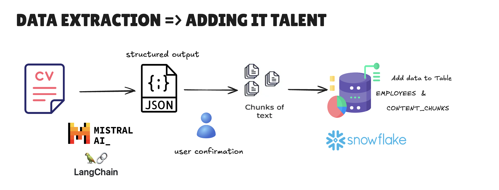

# Prosterio

  

  <b>Prosterio</b> is a Streamlit-based application designed to assist IT Project Managers in managing tech talent. It leverages AI technologies to extract, process, and match relevant data from PDF CVs to identify the most suitable developers for specific projects.
  

## Key Features

1. PDF CV Data Extraction:
   Extracts relevant information from PDF CVs and compiles it into a structured JSON format. [Implemented in extract_cv.py](./functions/extract_cv.py)

2. Chunking:
   Breaks down extracted CV data into chunks and stores embeddings in Snowflake to enhance search and matching capabilities. Implemented chunk with Langchain and Mistral from [extract_cv.py](./functions/extract_cv.py) to [chunks.py](./functions/chunks.py).

3. Retrieval-Augmented Generation (RAG) Implementation:
   Provides accurate developer-project matches using RAG with Snowflake and the Mistral model. The first implementation with vector search but now is already **implemented cortex search**.

   > SQL queries for RAG are defined in [SQL-VectorSearch.sql](./SQL-VectorSearch.sql) and [SQL-CortexSearch.sql](./SQL-CortexSearch.sql).

4. Chat Interface:
   A chat feature powered by Streamlit that allows project managers to interact with the system and query tech talent information.

5. User Authentication:
   Users can sign in, create accounts, and reset passwords using Firebase Authentication.
   Authentication functions are implemented in [auth_functions.py](./functions/auth_functions.py).

6. Dashboard:
   Users can view and analyze the added IT talent.

7. Settings:
   Users can manage their account settings and delete their data.

## Project Structure

- Main Application: app.py
- Functions: Various utility functions for authentication, data extraction, and database operations are located in the functions directory.
- Pages: Different pages of the Streamlit app, such as adding talent, dashboard, chat, and settings, are located in the pages directory.
- Configuration: Streamlit configuration and secrets are stored in the .streamlit directory.

## Tech Stack

- Snowflake: For cloud-based data storage, query handling, and processing.
  Mistral: Used as part of the RAG implementation for advanced language models.
- Streamlit: For creating an interactive front-end.
- LangChain: Core functionalities and integrations for advanced natural language processing (NLP).
- PyPDF: For parsing and extracting data from PDF CV files.
- Pydantic: For data validation and parsing.
- Pandas: For data manipulation, extraction and data visualization.
- Matplotlib : For data visualization.
- Firebase Authentication: For user authentication and account management.

## Usage

- **Add Talent**: Users can upload PDF CVs, which are processed and stored in the database.
  Dashboard: Users can view and analyze the added IT talent.
  
- **RAG**: Streamline your tech talents' CVs with chats powered by function Complete with LLM Mistral Large 2 from Snowflake and Cortex Search Service.
  
- **Chat**: Users can interact with the AI assistant to get recommendations and insights about tech talent.
  
- **Authentication**: Users can sign in, create accounts, and reset passwords using Firebase Authentication.
